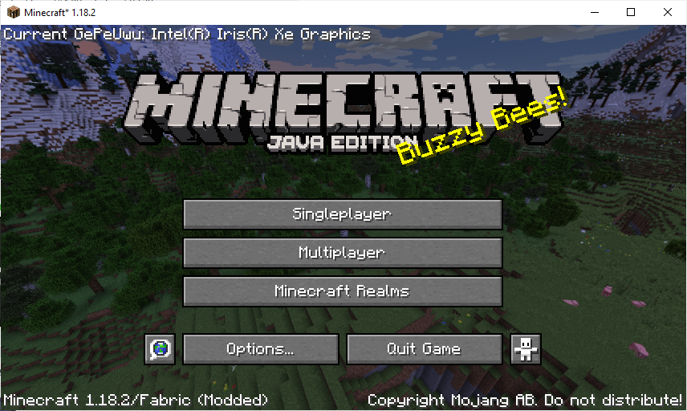
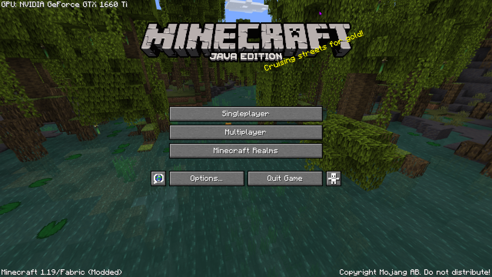
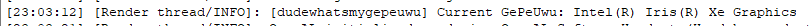
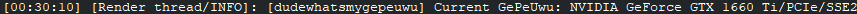

# Dude, What's My GePeUwu

A mod that tells what GPU you're using for Minecraft from the title screen and in your logs, thus letting you avoid the annoyance that is loading into a world and pressing f3 to find out what your GPU is.

Can be very useful if you have a dual GPU laptop or tower and trying to figure out what GPU is your Minecraft using!

### Ingame Title Screen

### Logs

## Downloads
[Modrinth](https://modrinth.com/mod/dudewhatsmygpu)

[CurseForge](https://www.curseforge.com/minecraft/mc-mods/dude-whats-my-gepeuwu/)

## License

This mod is licensed under the [MIT license](LICENSE).