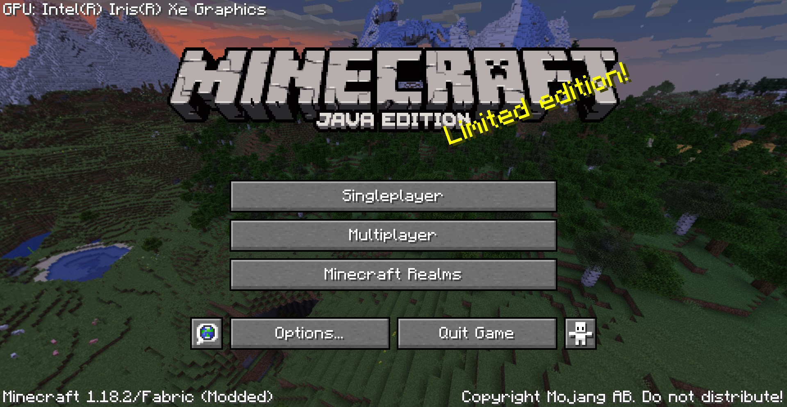

# Dude, What's My GePeUwu

  <a href="https://modrinth.com/mod/dudewhatsmygpu" target="_blank">
    <picture>
      <source media="(prefers-color-scheme: dark)" srcset="https://github.com/modrinth/art/blob/main/Branding/Badge/badge-dark__184x72.png?raw=true">
      
    </picture>
  </a>

A mod that tells what GPU you're using for Minecraft from the Menu screen and in your logs, useful to not need to launch 
the game constantly into singleplayer/multiplayer and joining to see from F3 screen.

Especially useful if you have a dual GPU laptop or tower and trying to figure out what GPU is your Minecraft using. 
[looking at you iGPU + dGPU laptop users]

## Downloads
[Modrinth](https://modrinth.com/mod/dudewhatsmygpu)

[CurseForge](https://www.curseforge.com/minecraft/mc-mods/dude-whats-my-gepeuwu/)

## License

This mod is licensed under the [MIT license](LICENSE).
